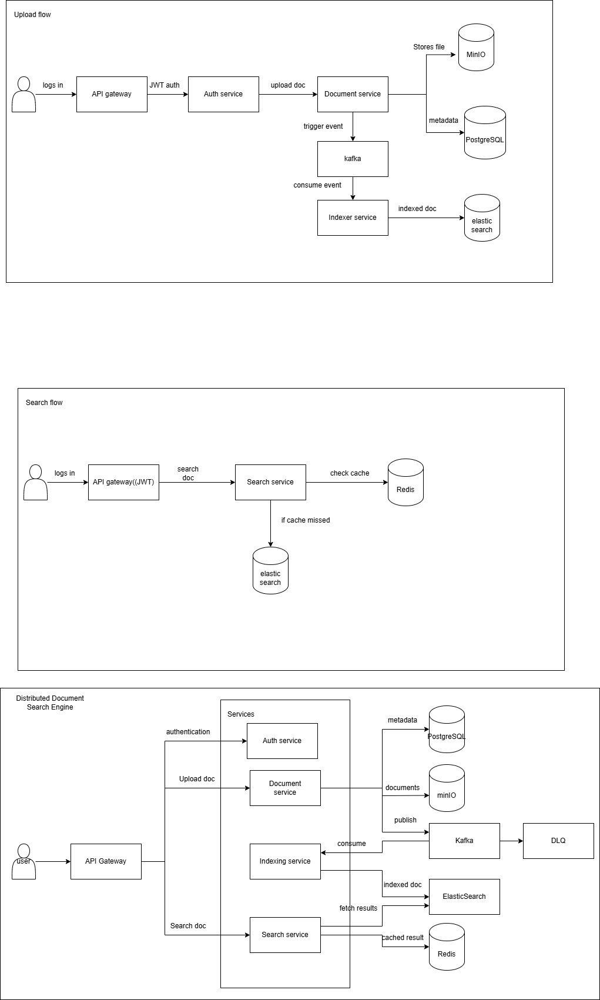

# Distributed Document Search Engine

A scalable backend system that allows users to upload documents and perform fast, ranked full-text search with metadata filtering.

## Features
- JWT-based authentication
- Document upload and storage (MinIO)
- Metadata storage (PostgreSQL)
- Asynchronous indexing using Kafka
- Full-text search using Elasticsearch
- Redis-based caching for search queries
- Pagination and filtering support

## Architecture
- API Gateway
- Auth Service
- Document Service
- Indexing Service
- Search Service
- Kafka, Redis, PostgreSQL, MinIO, Elasticsearch

## Tech Stack
- Java 17 , Spring Boot
- PostgreSQL
- MinIO
- Kafka
- ElasticSearch
- Redis
- Docker & Docker Compose

## High Level Flow

### Uplodad flow
User → API Gateway → Auth → Document Service → MinIO + PostgreSQL → Kafka → Indexing Service → Elasticsearch

### Search Flow
User → API Gateway → Search Service → Redis → Elasticsearch

## Design Decisions

- Kafka used to decouple upload from indexing
- Elasticsearch used for full-text search & ranking
- Redis used for cache-aside pattern
- MinIO used for scalable object storage
- DLQ implemented to handle poison messages
